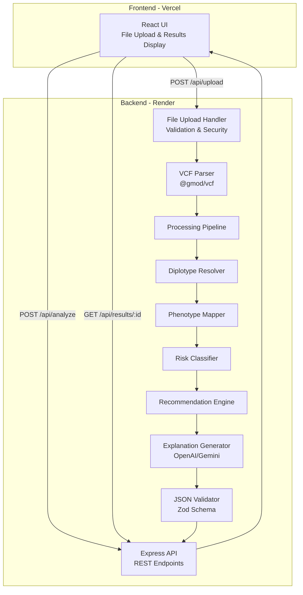

# Design Document: PharmaGuard - Pharmacogenomic Risk Prediction System

## Overview

PharmaGuard is a full-stack web application that analyzes genomic variants from VCF files to predict drug-gene interaction risks. The system follows a pipeline architecture where VCF files are uploaded, parsed for variants in six critical pharmacogenomic genes, processed through diplotype resolution and phenotype mapping, classified for drug interaction risks, and finally presented with CPIC-aligned recommendations and AI-powered explanations.

The architecture is optimized for hackathon constraints: rapid development, demo readiness, and strict JSON schema compliance for judge evaluation. The system uses a React frontend (Vite + JavaScript + TailwindCSS) deployed to Vercel and a Node.js/Express backend deployed to Render.

## Architecture

### System Architecture Diagram



### Technology Stack

**Frontend:**
- React 18 with Vite (fast development and build)
- JavaScript (no TypeScript per hackathon requirements)
- TailwindCSS for styling
- Axios for HTTP requests
- React hooks for state management

**Backend:**
- Node.js 18+ with Express.js
- @gmod/vcf for VCF parsing
- Zod for schema validation
- OpenAI SDK or Google Generative AI SDK for explanations
- Multer for file upload handling
- CORS middleware for cross-origin requests

**Deployment:**
- Frontend: Vercel (automatic deployments from Git)
- Backend: Render (containerized deployment)
- Environment variables for API keys and URLs

### Data Flow

1. User uploads VCF file through React UI
2. File is validated and temporarily stored on backend
3. VCF Parser extracts variants for six target genes
4. Diplotype Resolver determines star allele combinations
5. Phenotype Mapper converts diplotypes to metabolizer phenotypes
6. Risk Classifier evaluates drug-gene interactions
7. Recommendation Engine generates CPIC-aligned guidance
8. Explanation Generator creates plain-language summaries via LLM
9. JSON Validator ensures output matches hackathon schema
10. Results returned to frontend with color-coded visualization

## Components and Interfaces

### Frontend Components

#### FileUploadComponent
**Purpose:** Handle VCF file selection and upload

**Interface:**
```javascript
// Props
{
  onUploadSuccess: (uploadId) => void,
  onUploadError: (error) => void
}

// State
{
  selectedFile: File | null,
  uploading: boolean,
  uploadProgress: number
}

// Methods
handleFileSelect(event)
handleUpload()
validateFile(file) // Check extension and size
```

#### DrugInputComponent
**Purpose:** Allow users to specify drugs of interest for analysis

**Interface:**
```javascript
// Props
{
  onDrugsChange: (drugs) => void,
  supportedDrugs: string[]
}

// State
{
  selectedDrugs: string[],
  inputValue: string,
  validationError: string | null
}

// Methods
handleDrugInput(value) // Parse comma-separated or multi-select
validateDrugNames(drugs) // Check against supported drug list
clearDrugs()
```

#### ResultsDisplayComponent
**Purpose:** Visualize pharmacogenomic analysis results with color-coded risk levels

**Interface:**
```javascript
// Props
{
  results: AnalysisResults,
  loading: boolean
}

// State
{
  expandedGene: string | null,
  selectedInteraction: DrugGeneInteraction | null
}

// Methods
renderGeneSection(gene)
renderInteraction(interaction)
getColorForRiskLevel(riskLevel) // Red, Yellow, Green, Gray
```

#### ExplanationModalComponent
**Purpose:** Display detailed explanations and recommendations

**Interface:**
```javascript
// Props
{
  interaction: DrugGeneInteraction,
  explanation: string,
  recommendation: string,
  onClose: () => void
}
```

### Backend Components

#### FileUploadHandler
**Purpose:** Securely handle VCF file uploads with validation

**Interface:**
```javascript
// Express middleware configuration
const upload = multer({
  dest: 'uploads/temp/',
  limits: { fileSize: 50 * 1024 * 1024 }, // 50MB
  fileFilter: (req, file, cb) => {
    // Validate .vcf or .vcf.gz extension
  }
})

// Route handler
POST /api/upload
Request: multipart/form-data with 'vcfFile' field
Response: { uploadId: string, filename: string }
```

#### VCFParser
**Purpose:** Parse VCF files and extract variants for target genes

**Interface:**
```javascript
class VCFParser {
  constructor(vcfFilePath)
  
  async parseVariants()
  // Returns: Variant[]
  
  filterTargetGenes(variants)
  // Returns: Variant[] (filtered for CYP2D6, CYP2C19, CYP2C9, VKORC1, SLCO1B1, DPYD)
}

// Variant structure
{
  chromosome: string,
  position: number,
  refAllele: string,
  altAllele: string,
  gene: string,
  rsId: string | null
}
```

#### DiplotypeResolver
**Purpose:** Resolve diplotypes from variant data using star allele nomenclature

**Interface:**
```javascript
class DiplotypeResolver {
  constructor(variants)
  
  resolveDiplotypes()
  // Returns: Map<GeneName, Diplotype>
  
  resolveGene(geneName, geneVariants)
  // Returns: Diplotype { allele1: string, allele2: string, notation: string }
  
  matchStarAllele(variants, alleleDefinition)
  // Returns: boolean
}

// Diplotype structure
{
  gene: string,
  allele1: string, // e.g., "*1"
  allele2: string, // e.g., "*2"
  notation: string, // e.g., "*1/*2"
  confidence: "high" | "medium" | "low"
}
```

**Star Allele Definitions:**
The resolver uses hardcoded star allele definitions for the six target genes based on PharmVar database. Each star allele is defined by a set of characteristic variants.

Example for CYP2D6:
```javascript
const CYP2D6_ALLELES = {
  "*1": [], // Wild-type (no variants)
  "*2": [{ rsId: "rs16947", position: 2850, alt: "A" }],
  "*3": [{ rsId: "rs35742686", position: 2549, alt: "delA" }],
  "*4": [{ rsId: "rs3892097", position: 1846, alt: "A" }],
  // ... additional alleles
}
```

#### PhenotypeMapper
**Purpose:** Map diplotypes to metabolizer phenotypes using CPIC guidelines

**Interface:**
```javascript
class PhenotypeMapper {
  constructor(diplotypes)
  
  mapPhenotypes()
  // Returns: Map<GeneName, Phenotype>
  
  getPhenotypeForDiplotype(gene, diplotype)
  // Returns: Phenotype
}

// Phenotype structure
{
  gene: string,
  diplotype: string,
  phenotype: "Poor Metabolizer" | "Intermediate Metabolizer" | 
             "Normal Metabolizer" | "Rapid Metabolizer" | 
             "Ultrarapid Metabolizer" | "Unknown Metabolizer",
  activityScore: number | null // CPIC activity score
}
```

**Phenotype Mapping Tables:**
Each gene has a diplotype-to-phenotype mapping table based on CPIC guidelines.

Example for CYP2D6:
```javascript
const CYP2D6_PHENOTYPE_MAP = {
  "*1/*1": { phenotype: "Normal Metabolizer", activityScore: 2.0 },
  "*1/*2": { phenotype: "Normal Metabolizer", activityScore: 2.0 },
  "*1/*4": { phenotype: "Intermediate Metabolizer", activityScore: 1.0 },
  "*4/*4": { phenotype: "Poor Metabolizer", activityScore: 0.0 },
  // ... additional mappings
}
```

#### RiskClassifier
**Purpose:** Classify drug-gene interaction risks based on phenotypes

**Interface:**
```javascript
class RiskClassifier {
  constructor(phenotypes, requestedDrugs = null)
  
  classifyRisks()
  // Returns: DrugGeneInteraction[]
  // If requestedDrugs is provided, only analyzes those drugs
  // Otherwise, analyzes all supported drugs
  
  getRiskForDrugGene(drug, gene, phenotype)
  // Returns: RiskLevel
  
  filterByRequestedDrugs(interactions, requestedDrugs)
  // Returns: DrugGeneInteraction[] (filtered)
}

// DrugGeneInteraction structure
{
  gene: string,
  drug: string,
  phenotype: string,
  riskLevel: "high_risk" | "moderate_risk" | "low_risk" | "no_known_interaction",
  cpicLevel: "A" | "B" | "C" | "D" // CPIC evidence level
}
```

**Drug-Gene Risk Matrix:**
Hardcoded risk classifications based on CPIC guidelines for common medications.

Example for CYP2D6:
```javascript
const CYP2D6_DRUG_RISKS = {
  "codeine": {
    "Poor Metabolizer": "low_risk", // Reduced efficacy
    "Ultrarapid Metabolizer": "high_risk", // Toxicity risk
    "Normal Metabolizer": "no_known_interaction"
  },
  "tamoxifen": {
    "Poor Metabolizer": "high_risk", // Reduced efficacy
    "Intermediate Metabolizer": "moderate_risk",
    "Normal Metabolizer": "no_known_interaction"
  }
  // ... additional drugs
}
```

**Supported Drugs List:**
The system maintains a comprehensive list of supported drugs across all six target genes. When users specify drugs, the system validates against this list and only analyzes requested drugs. If no drugs are specified, all supported drugs are analyzed.

#### RecommendationEngine
**Purpose:** Generate CPIC-aligned clinical recommendations

**Interface:**
```javascript
class RecommendationEngine {
  constructor(interactions)
  
  generateRecommendations()
  // Returns: Recommendation[]
  
  getRecommendationForInteraction(interaction)
  // Returns: Recommendation
}

// Recommendation structure
{
  gene: string,
  drug: string,
  riskLevel: string,
  recommendation: string, // Clinical action
  strength: "Strong" | "Moderate" | "Optional",
  cpicGuideline: string, // Reference to CPIC guideline version
  alternatives: string[] // Alternative medications if applicable
}
```

**Recommendation Templates:**
Each drug-gene-phenotype combination has a template recommendation based on CPIC guidelines.

Example:
```javascript
const RECOMMENDATIONS = {
  "CYP2D6_codeine_ultrarapid": {
    recommendation: "Avoid codeine use. Choose alternative analgesic not metabolized by CYP2D6 (e.g., morphine, hydromorphone).",
    strength: "Strong",
    cpicGuideline: "CPIC Guideline for CYP2D6 and Codeine (2014)",
    alternatives: ["morphine", "hydromorphone", "oxycodone"]
  }
}
```

#### ExplanationGenerator
**Purpose:** Generate plain-language explanations using LLM

**Interface:**
```javascript
class ExplanationGenerator {
  constructor(apiKey, model) // OpenAI or Gemini
  
  async generateExplanations(interactions, recommendations)
  // Returns: Map<InteractionKey, Explanation>
  
  async generateExplanation(interaction, recommendation)
  // Returns: string (plain-language explanation)
  
  getFallbackExplanation(interaction)
  // Returns: string (template-based fallback)
}

// LLM Prompt Template
const EXPLANATION_PROMPT = `
You are a genetic counselor explaining pharmacogenomic results to a patient.

Gene: ${gene}
Drug: ${drug}
Phenotype: ${phenotype}
Risk Level: ${riskLevel}
Recommendation: ${recommendation}

Explain this result in simple, non-technical language that a patient without medical training can understand. Use analogies if helpful. Keep it under 150 words.
`
```

**Fallback Explanations:**
Template-based explanations used when LLM API is unavailable.

Example:
```javascript
const FALLBACK_EXPLANATIONS = {
  "high_risk": "Your genetic makeup affects how your body processes ${drug}. This creates a higher risk of side effects or reduced effectiveness. Your doctor should consider alternative medications.",
  "moderate_risk": "Your genes may affect how ${drug} works in your body. Your doctor might need to adjust the dose or monitor you more closely.",
  "low_risk": "Your genetic profile suggests ${drug} should work normally for you, but your doctor will still monitor your response.",
  "no_known_interaction": "Based on current research, your genetic profile doesn't significantly affect how ${drug} works."
}
```

#### JSONValidator
**Purpose:** Validate output against hackathon JSON schema using Zod

**Interface:**
```javascript
const OutputSchema = z.object({
  patient_id: z.string(),
  analysis_date: z.string().datetime(),
  genes: z.array(z.object({
    name: z.string(),
    diplotype: z.string(),
    phenotype: z.string(),
    activity_score: z.number().nullable()
  })),
  drug_interactions: z.array(z.object({
    gene_name: z.string(),
    drug_name: z.string(),
    risk_level: z.enum(["high_risk", "moderate_risk", "low_risk", "no_known_interaction"]),
    phenotype: z.string(),
    cpic_level: z.string()
  })),
  recommendations: z.array(z.object({
    drug_name: z.string(),
    gene_name: z.string(),
    recommendation: z.string(),
    strength: z.enum(["Strong", "Moderate", "Optional"]),
    alternatives: z.array(z.string()).optional()
  })),
  explanations: z.array(z.object({
    drug_name: z.string(),
    gene_name: z.string(),
    explanation: z.string()
  }))
})

class JSONValidator {
  validate(output)
  // Returns: { valid: boolean, errors: string[] | null }
}
```

### API Endpoints

#### POST /api/upload
**Purpose:** Upload VCF file

**Request:**
```
Content-Type: multipart/form-data
Body: vcfFile (File)
```

**Response:**
```json
{
  "uploadId": "uuid-v4",
  "filename": "patient_sample.vcf",
  "size": 1048576
}
```

**Error Responses:**
- 400: Invalid file format or size exceeded
- 500: Server error during upload

#### POST /api/analyze
**Purpose:** Analyze uploaded VCF file

**Request:**
```json
{
  "uploadId": "uuid-v4",
  "patientId": "optional-patient-identifier",
  "drugs": ["codeine", "tamoxifen", "warfarin"]  // Optional: specific drugs to analyze
}
```

**Response:**
```json
{
  "analysisId": "uuid-v4",
  "status": "processing",
  "estimatedTime": 25
}
```

**Error Responses:**
- 400: Invalid uploadId or missing file
- 400: Invalid drug names (not in supported drug list)
- 500: Processing error

**Note:** If `drugs` array is not provided or is empty, the system analyzes all supported drugs by default.

#### GET /api/results/:analysisId
**Purpose:** Retrieve analysis results

**Response:**
```json
{
  "patient_id": "P12345",
  "analysis_date": "2026-01-15T10:30:00Z",
  "genes": [
    {
      "name": "CYP2D6",
      "diplotype": "*1/*4",
      "phenotype": "Intermediate Metabolizer",
      "activity_score": 1.0
    }
  ],
  "drug_interactions": [
    {
      "gene_name": "CYP2D6",
      "drug_name": "codeine",
      "risk_level": "moderate_risk",
      "phenotype": "Intermediate Metabolizer",
      "cpic_level": "A"
    }
  ],
  "recommendations": [
    {
      "drug_name": "codeine",
      "gene_name": "CYP2D6",
      "recommendation": "Consider 50% dose reduction or alternative analgesic",
      "strength": "Moderate",
      "alternatives": ["tramadol", "hydrocodone"]
    }
  ],
  "explanations": [
    {
      "drug_name": "codeine",
      "gene_name": "CYP2D6",
      "explanation": "Your body processes codeine at a slower rate than average..."
    }
  ]
}
```

**Error Responses:**
- 404: Analysis not found
- 500: Error retrieving results

## Data Models

### Variant
```javascript
{
  chromosome: string,        // e.g., "chr22"
  position: number,          // Genomic position
  refAllele: string,         // Reference allele
  altAllele: string,         // Alternate allele
  gene: string,              // Gene name (one of six target genes)
  rsId: string | null,       // dbSNP reference ID
  quality: number | null,    // Variant quality score
  filter: string             // PASS or filter reason
}
```

### Diplotype
```javascript
{
  gene: string,              // Gene name
  allele1: string,           // First allele (e.g., "*1")
  allele2: string,           // Second allele (e.g., "*4")
  notation: string,          // Combined notation (e.g., "*1/*4")
  confidence: string         // "high" | "medium" | "low"
}
```

### Phenotype
```javascript
{
  gene: string,              // Gene name
  diplotype: string,         // Diplotype notation
  phenotype: string,         // Metabolizer phenotype
  activityScore: number | null  // CPIC activity score (0.0 - 3.0)
}
```

### DrugGeneInteraction
```javascript
{
  gene: string,              // Gene name
  drug: string,              // Drug name
  phenotype: string,         // Metabolizer phenotype
  riskLevel: string,         // "high_risk" | "moderate_risk" | "low_risk" | "no_known_interaction"
  cpicLevel: string          // CPIC evidence level ("A", "B", "C", "D")
}
```

### Recommendation
```javascript
{
  gene: string,              // Gene name
  drug: string,              // Drug name
  riskLevel: string,         // Risk level
  recommendation: string,    // Clinical recommendation text
  strength: string,          // "Strong" | "Moderate" | "Optional"
  cpicGuideline: string,     // Reference to CPIC guideline
  alternatives: string[]     // Alternative medications
}
```

### AnalysisResult (Final Output)
```javascript
{
  patient_id: string,
  analysis_date: string,     // ISO 8601 datetime
  genes: Gene[],
  drug_interactions: DrugGeneInteraction[],
  recommendations: Recommendation[],
  explanations: Explanation[]
}
```


## Correctness Properties

*A property is a characteristic or behavior that should hold true across all valid executions of a system—essentially, a formal statement about what the system should do. Properties serve as the bridge between human-readable specifications and machine-verifiable correctness guarantees.*

### Property Reflection

After analyzing all acceptance criteria, I identified the following redundancies:
- Property for file size validation (1.2) is an edge case that will be covered by the file extension validation property's generator
- Requirement 12.3 (file size limits) is redundant with 1.2
- Several properties about "all required fields present" can be combined into comprehensive structure validation properties
- Properties about CPIC alignment (4.2, 5.3, 6.2) are data validation, not behavioral properties
- Multiple properties about output structure (8.2, 8.3) can be combined into a single schema validation property

### File Upload and Validation Properties

**Property 1: File extension validation**
*For any* uploaded file, the File_Upload_Handler should accept the file if and only if it has a .vcf or .vcf.gz extension
**Validates: Requirements 1.1**

**Property 2: Valid uploads return unique identifiers**
*For any* valid VCF file upload, the Backend_API should return a unique upload identifier that differs from all previous upload identifiers
**Validates: Requirements 1.4**

**Property 3: Invalid file formats produce descriptive errors**
*For any* file with an invalid extension, the File_Upload_Handler should return an error message that specifies the expected .vcf or .vcf.gz format
**Validates: Requirements 1.5**

### VCF Parsing Properties

**Property 4: All variants are extracted**
*For any* valid VCF file with N variant records, the VCF_Parser should extract exactly N variants
**Validates: Requirements 2.1**

**Property 5: Only target gene variants are retained**
*For any* VCF file containing variants, all variants returned by the VCF_Parser should have a gene field matching one of the six Target_Genes (CYP2D6, CYP2C19, CYP2C9, VKORC1, SLCO1B1, DPYD)
**Validates: Requirements 2.2**

**Property 6: Malformed records don't prevent valid record processing**
*For any* VCF file containing both valid and malformed records, the VCF_Parser should extract all valid variants regardless of malformed record presence
**Validates: Requirements 2.3**

**Property 7: Extracted variants have required structure**
*For any* variant extracted by the VCF_Parser, the variant object should contain chromosome, position, refAllele, altAllele, and gene fields
**Validates: Requirements 2.4**

### Diplotype Resolution Properties

**Property 8: Diplotypes resolved for all target genes**
*For any* variant set, the Diplotype_Resolver should return diplotype results for all six Target_Genes
**Validates: Requirements 3.2**

**Property 9: Missing gene data defaults to wild-type**
*For any* Target_Gene with no variants in the input data, the Diplotype_Resolver should assign diplotype "*1/*1"
**Validates: Requirements 3.3**

**Property 10: Diplotypes follow star allele notation**
*For any* resolved diplotype, the notation should match the pattern "\\*[0-9]+/\\*[0-9]+" (e.g., "*1/*2")
**Validates: Requirements 3.4**

### Phenotype Mapping Properties

**Property 11: All diplotypes map to phenotypes**
*For any* resolved diplotype, the Phenotype_Mapper should return a valid Metabolizer_Phenotype (Poor, Intermediate, Normal, Rapid, Ultrarapid, or Unknown Metabolizer)
**Validates: Requirements 4.1**

**Property 12: Unmapped diplotypes get unknown status**
*For any* diplotype not in the phenotype mapping table, the Phenotype_Mapper should assign "Unknown Metabolizer" phenotype
**Validates: Requirements 4.3**

**Property 13: All target genes have phenotype mappings**
*For any* set of diplotypes covering all six Target_Genes, the Phenotype_Mapper should return phenotype labels for all six genes
**Validates: Requirements 4.5**

### Risk Classification Properties

**Property 14: Each drug-gene pair has exactly one risk level**
*For any* drug-gene pair evaluated by the Risk_Classifier, exactly one Risk_Level should be assigned (no duplicates, no missing)
**Validates: Requirements 5.2**

**Property 15: Unknown interactions get no_known_interaction status**
*For any* drug-gene pair not in the risk classification matrix, the Risk_Classifier should assign "no_known_interaction" risk level
**Validates: Requirements 5.4**

**Property 16: All interactions have risk levels**
*For any* list of drug-gene interactions returned by the Risk_Classifier, every interaction should have a risk_level field with a valid Risk_Level value
**Validates: Requirements 5.5**

### Recommendation Generation Properties

**Property 17: High-risk interactions produce actionable recommendations**
*For any* drug-gene interaction with "high_risk" level, the Recommendation_Engine should generate a non-empty recommendation containing actionable guidance (dose adjustment, alternative medication, or avoidance)
**Validates: Requirements 6.1**

**Property 18: Moderate-risk recommendations include dosing guidance**
*For any* drug-gene interaction with "moderate_risk" level, the recommendation should contain dosing-related keywords (dose, adjust, reduce, increase, monitor)
**Validates: Requirements 6.3**

**Property 19: All risk levels produce recommendations**
*For any* drug-gene interaction regardless of risk level, the Recommendation_Engine should generate a non-empty recommendation string
**Validates: Requirements 6.4**

**Property 20: Recommendations include strength levels**
*For any* recommendation generated, it should include a strength field with value "Strong", "Moderate", or "Optional"
**Validates: Requirements 6.5**

### Explanation Generation Properties

**Property 21: All interactions receive explanations**
*For any* drug-gene interaction, the Explanation_Generator should produce a non-empty plain-language explanation
**Validates: Requirements 7.1**

**Property 22: LLM failures trigger fallback explanations**
*For any* drug-gene interaction, if the LLM API call fails or times out, the Explanation_Generator should return a template-based fallback explanation rather than an empty string or error
**Validates: Requirements 7.5**

### JSON Schema Validation Properties

**Property 23: Output validation occurs before response**
*For any* analysis result, the JSON_Validator should validate the output structure before the Backend_API returns it to the client
**Validates: Requirements 8.1**

**Property 24: Output contains all required top-level fields**
*For any* analysis result output, it should contain patient_id, analysis_date, genes, drug_interactions, recommendations, and explanations fields
**Validates: Requirements 8.2**

**Property 25: Drug interactions have required fields**
*For any* drug interaction object in the output, it should contain gene_name, drug_name, risk_level, and phenotype fields
**Validates: Requirements 8.3**

**Property 26: Validation failures prevent invalid JSON responses**
*For any* analysis result that fails schema validation, the Backend_API should return a 500 error response rather than returning the invalid JSON
**Validates: Requirements 8.5**

### Frontend UI Properties

**Property 27: Risk levels map to correct colors**
*For any* drug-gene interaction displayed in the Frontend_UI, the color should be Red for high_risk, Yellow for moderate_risk, Green for low_risk, and Gray for no_known_interaction
**Validates: Requirements 9.2**

**Property 28: Results are grouped by gene**
*For any* analysis result displayed, all drug interactions for the same gene should be grouped together in the UI
**Validates: Requirements 9.4**

**Property 29: Clicking interactions displays details**
*For any* drug-gene interaction in the results view, clicking it should display the full explanation and recommendation
**Validates: Requirements 9.5**

### Error Handling Properties

**Property 30: All errors are logged with required information**
*For any* error that occurs in any component, the Backend_API should log an entry containing timestamp, component name, and error details
**Validates: Requirements 10.1**

**Property 31: Processing errors return structured responses**
*For any* processing error, the Backend_API should return a response object containing an error_code field and a message field
**Validates: Requirements 10.2**

**Property 32: LLM failures don't fail the request**
*For any* analysis request, if the LLM API is unavailable, the system should still return a complete analysis result with fallback explanations
**Validates: Requirements 10.4**

**Property 33: Failed uploads clean up partial files**
*For any* file upload that fails after partial data is written, the File_Upload_Handler should remove any temporary files created during the upload attempt
**Validates: Requirements 10.5**

### API Endpoint Properties

**Property 34: Invalid request parameters return 400 errors**
*For any* API endpoint, when receiving a request with invalid or missing required parameters, the Backend_API should return a 400 status code
**Validates: Requirements 11.4**

**Property 35: Responses have appropriate status codes**
*For any* API response, the HTTP status code should be 200 for success, 400 for client errors, 404 for not found, or 500 for server errors
**Validates: Requirements 11.5**

### Security Properties

**Property 36: File paths are sanitized**
*For any* file path provided in a request, the Backend_API should reject paths containing directory traversal patterns (../, ..\, etc.)
**Validates: Requirements 12.4**

**Property 37: Logs don't contain PII**
*For any* log entry created by the system, it should not contain patient identifiable information patterns (names, SSNs, dates of birth)
**Validates: Requirements 12.5**

## Error Handling

### File Upload Errors

**Invalid File Format:**
- Error Code: `INVALID_FILE_FORMAT`
- HTTP Status: 400
- Message: "Invalid file format. Please upload a .vcf or .vcf.gz file."
- Action: Reject upload, prompt user to select correct file type

**File Size Exceeded:**
- Error Code: `FILE_TOO_LARGE`
- HTTP Status: 400
- Message: "File size exceeds 50MB limit. Please upload a smaller VCF file."
- Action: Reject upload, suggest file compression or filtering

**Malicious Content Detected:**
- Error Code: `SECURITY_VIOLATION`
- HTTP Status: 400
- Message: "File failed security scan. Please ensure the file is a valid VCF file."
- Action: Reject upload, log security event

### VCF Parsing Errors

**Malformed VCF File:**
- Error Code: `VCF_PARSE_ERROR`
- HTTP Status: 400
- Message: "Unable to parse VCF file. Please ensure the file follows VCF format specification."
- Action: Return specific line number and parsing issue if available

**No Target Gene Variants:**
- Error Code: `NO_VARIANTS_FOUND`
- HTTP Status: 200 (not an error, but informational)
- Message: "No variants found in target pharmacogenomic genes."
- Action: Return empty results with explanation

**Corrupted File:**
- Error Code: `FILE_CORRUPTED`
- HTTP Status: 400
- Message: "File appears to be corrupted. Please re-upload."
- Action: Suggest re-downloading or re-exporting VCF file

### Processing Errors

**Diplotype Resolution Failure:**
- Error Code: `DIPLOTYPE_RESOLUTION_ERROR`
- HTTP Status: 500
- Message: "Unable to resolve diplotypes for one or more genes."
- Action: Log detailed error, return partial results with unresolved genes flagged

**Phenotype Mapping Failure:**
- Error Code: `PHENOTYPE_MAPPING_ERROR`
- HTTP Status: 500
- Message: "Unable to map diplotypes to phenotypes."
- Action: Log error, return diplotypes with "Unknown Metabolizer" phenotype

**Risk Classification Failure:**
- Error Code: `RISK_CLASSIFICATION_ERROR`
- HTTP Status: 500
- Message: "Unable to classify drug-gene interaction risks."
- Action: Log error, return partial results with available classifications

### External API Errors

**LLM API Unavailable:**
- Error Code: `LLM_API_ERROR`
- HTTP Status: 200 (use fallback, don't fail request)
- Message: Logged internally, not exposed to user
- Action: Use template-based fallback explanations

**LLM API Timeout:**
- Error Code: `LLM_TIMEOUT`
- HTTP Status: 200 (use fallback)
- Message: Logged internally
- Action: Use template-based fallback explanations after 10-second timeout

**LLM API Rate Limit:**
- Error Code: `LLM_RATE_LIMIT`
- HTTP Status: 200 (use fallback)
- Message: Logged internally
- Action: Use template-based fallback explanations

### Validation Errors

**Schema Validation Failure:**
- Error Code: `SCHEMA_VALIDATION_ERROR`
- HTTP Status: 500
- Message: "Internal error: Output validation failed."
- Action: Log validation errors, prevent returning invalid JSON to client

**Missing Required Fields:**
- Error Code: `MISSING_REQUIRED_FIELDS`
- HTTP Status: 500
- Message: "Internal error: Required data fields missing."
- Action: Log missing fields, investigate data pipeline issue

### General Error Handling Strategy

1. **Graceful Degradation:** System continues operating with reduced functionality rather than complete failure
2. **Detailed Logging:** All errors logged with context for debugging
3. **User-Friendly Messages:** Technical errors translated to actionable user guidance
4. **Fallback Mechanisms:** Template-based explanations when LLM unavailable
5. **Partial Results:** Return available results even if some processing steps fail
6. **Security First:** Never expose internal system details or stack traces to users

## Testing Strategy

### Dual Testing Approach

PharmaGuard uses both unit testing and property-based testing to ensure comprehensive correctness:

**Unit Tests** validate:
- Specific examples of correct behavior
- Edge cases (empty files, boundary conditions)
- Error conditions and error messages
- Integration points between components
- API endpoint contracts

**Property-Based Tests** validate:
- Universal properties that hold for all inputs
- Comprehensive input coverage through randomization
- Invariants that must always be maintained
- Round-trip properties (parsing/serialization)

Both testing approaches are complementary and necessary. Unit tests catch concrete bugs with specific inputs, while property tests verify general correctness across the input space.

### Property-Based Testing Configuration

**Library Selection:**
- **Frontend:** fast-check (JavaScript property-based testing library)
- **Backend:** fast-check (Node.js compatible)

**Test Configuration:**
- Minimum 100 iterations per property test (due to randomization)
- Each property test references its design document property
- Tag format: `// Feature: pharmaguard-risk-prediction, Property {number}: {property_text}`

**Example Property Test Structure:**
```javascript
// Feature: pharmaguard-risk-prediction, Property 1: File extension validation
test('File extension validation property', () => {
  fc.assert(
    fc.property(
      fc.string(), // Generate random filenames
      (filename) => {
        const hasValidExtension = filename.endsWith('.vcf') || filename.endsWith('.vcf.gz');
        const isAccepted = fileUploadHandler.validateExtension(filename);
        return hasValidExtension === isAccepted;
      }
    ),
    { numRuns: 100 }
  );
});
```

### Unit Testing Strategy

**Frontend Unit Tests (Vitest + React Testing Library):**
- Component rendering with different props
- User interaction handling (file selection, clicks)
- Color coding for risk levels
- Error message display
- Loading states

**Backend Unit Tests (Jest):**
- API endpoint request/response contracts
- Error handling for specific error conditions
- File upload validation edge cases
- VCF parsing with sample files
- Diplotype resolution with known variants
- Phenotype mapping with known diplotypes
- Risk classification with known phenotypes
- Recommendation generation for specific risk levels
- JSON schema validation with valid and invalid outputs

### Integration Testing

**End-to-End Flow Tests:**
1. Upload sample VCF file → Verify upload confirmation
2. Trigger analysis → Verify processing status
3. Retrieve results → Verify complete JSON structure
4. Display results → Verify UI rendering

**Component Integration Tests:**
1. VCF Parser → Diplotype Resolver integration
2. Diplotype Resolver → Phenotype Mapper integration
3. Phenotype Mapper → Risk Classifier integration
4. Risk Classifier → Recommendation Engine integration
5. Recommendation Engine → Explanation Generator integration
6. Complete pipeline → JSON Validator integration

### Test Data

**Sample VCF Files:**
- `sample_wildtype.vcf`: All *1/*1 diplotypes (no variants)
- `sample_cyp2d6_poor.vcf`: CYP2D6 *4/*4 (poor metabolizer)
- `sample_cyp2d6_ultra.vcf`: CYP2D6 with gene duplication (ultrarapid)
- `sample_mixed.vcf`: Multiple genes with various diplotypes
- `sample_malformed.vcf`: Contains parsing errors
- `sample_large.vcf`: 10MB file for performance testing

**Mock Data:**
- Predefined variant sets for each target gene
- Known diplotype-phenotype mappings
- Drug-gene interaction test cases
- CPIC guideline reference data

### Testing Priorities for Hackathon

Given hackathon time constraints, prioritize testing in this order:

1. **Critical Path:** VCF parsing → Diplotype resolution → Phenotype mapping → Risk classification
2. **Schema Validation:** JSON output structure (disqualification risk)
3. **Error Handling:** File upload validation, parsing errors
4. **Property Tests:** Core correctness properties (Properties 1-26)
5. **Integration Tests:** End-to-end flow with sample files
6. **UI Tests:** Color coding, results display

### Continuous Testing During Development

- Run unit tests after each component implementation
- Run property tests after completing each module
- Test with sample VCF files frequently
- Validate JSON output against schema continuously
- Test error conditions as they're implemented

### Demo Testing Checklist

Before demo/submission:
- [ ] Upload and analyze all sample VCF files successfully
- [ ] Verify JSON output matches exact schema specification
- [ ] Test all error conditions (invalid file, parsing errors)
- [ ] Verify color coding displays correctly for all risk levels
- [ ] Test LLM explanation generation and fallback
- [ ] Verify deployment on Vercel and Render
- [ ] Test cross-origin requests between deployed frontend and backend
- [ ] Verify all API endpoints respond correctly
- [ ] Test with judge-provided sample VCF if available
- [ ] Record demo video with smooth workflow

## Implementation Notes

### Development Workflow

1. **Backend First:** Implement core processing pipeline before frontend
2. **Test with Sample Data:** Use sample VCF files throughout development
3. **Validate Early:** Test JSON schema compliance from the start
4. **Mock LLM Initially:** Use fallback explanations during development, add LLM later
5. **Deploy Early:** Deploy to Render/Vercel early to catch deployment issues

### Critical Success Factors

1. **JSON Schema Compliance:** This is the #1 disqualification risk - validate constantly
2. **VCF Parsing Robustness:** Handle malformed files gracefully
3. **Error Handling:** Never crash, always return meaningful errors
4. **Demo Readiness:** System must work smoothly for video recording
5. **Performance:** Keep processing under 30 seconds for demo files

### Hackathon Optimization Strategies

**Simplifications for Speed:**
- Hardcode star allele definitions (don't fetch from external databases)
- Use simplified diplotype resolution (focus on common alleles)
- Limit drug list to 10-15 well-documented drugs per gene
- Use template-based recommendations with LLM enhancement
- Skip authentication/authorization (demo system)
- Use in-memory storage (no database)

**Quality Maintenance:**
- Keep code clean and commented for judge review
- Write comprehensive README
- Include sample files in repository
- Document all CPIC guideline references
- Maintain clear separation of concerns

### Deployment Configuration

**Environment Variables:**

Frontend (.env):
```
VITE_API_URL=https://pharmaguard-api.render.com
```

Backend (.env):
```
PORT=3000
OPENAI_API_KEY=sk-...
CORS_ORIGIN=https://pharmaguard.vercel.app
MAX_FILE_SIZE=52428800
UPLOAD_DIR=/tmp/uploads
```

**Vercel Configuration (vercel.json):**
```json
{
  "buildCommand": "npm run build",
  "outputDirectory": "dist",
  "framework": "vite"
}
```

**Render Configuration (render.yaml):**
```yaml
services:
  - type: web
    name: pharmaguard-api
    env: node
    buildCommand: npm install
    startCommand: npm start
    envVars:
      - key: NODE_ENV
        value: production
```

### Security Considerations

**File Upload Security:**
- Validate file extensions before processing
- Limit file size to prevent DoS
- Store uploads in temporary directory with restricted permissions
- Delete files after processing (1-hour retention max)
- Sanitize file paths to prevent directory traversal

**API Security:**
- Implement CORS with specific origin whitelist
- Validate all input parameters
- Rate limit API endpoints (if time permits)
- Don't log or store PII from VCF files
- Use HTTPS in production (Vercel/Render provide this)

**LLM API Security:**
- Store API keys in environment variables
- Don't expose API keys in client-side code
- Implement timeouts to prevent hanging requests
- Use fallback explanations if API unavailable

### Performance Optimization

**VCF Parsing:**
- Stream large files rather than loading entirely into memory
- Filter for target genes early in parsing pipeline
- Use efficient variant matching algorithms

**Diplotype Resolution:**
- Cache star allele definitions
- Use hash maps for fast variant lookup
- Limit allele matching to common variants

**LLM Explanations:**
- Generate explanations in parallel for multiple interactions
- Implement 10-second timeout per explanation
- Cache common explanations (if time permits)

**Frontend:**
- Lazy load results sections
- Use virtual scrolling for large result sets
- Optimize re-renders with React.memo

### Known Limitations (Acceptable for Hackathon)

1. **Simplified Diplotype Resolution:** Focuses on common star alleles, may not handle rare variants
2. **Limited Drug Coverage:** 10-15 drugs per gene rather than comprehensive coverage
3. **No Copy Number Variation:** CYP2D6 duplications/deletions simplified
4. **No Phasing:** Assumes variants are phased (may not be accurate for all cases)
5. **Template-Based Recommendations:** CPIC-aligned but not dynamically generated
6. **No User Accounts:** Single-session demo system
7. **No Result Persistence:** Results not saved to database
8. **Limited Error Recovery:** Some edge cases may not be handled perfectly

These limitations are acceptable for a hackathon demo but should be documented clearly.
